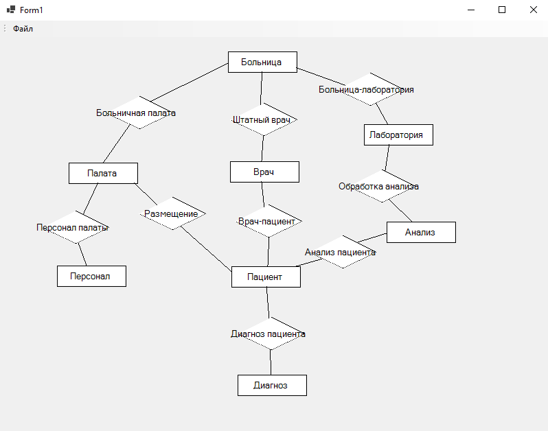

# SimpleDiagrammer_NET_Demo
Реализация простого ER-диаграммера на .NET с поддержкой сохранения диаграмм в файлы БД SQLite.

В редакторе доступны все основные операции с диаграммой и элементами: создание диаграммы, сохранение диаграммы в файл, открытие диаграммы из файла; создание, переименование, перетаскивание, удаление элементов; соединения элементов ребрами.

Преобразования записей таблиц БД в объекты графических элементов диаграмм реализуются в соответствии с паттерном "Data Mapper" и демонстрируют его применение.
## Third party licenses
>This application uses NuGet package Microsoft.EntityFrameworkCore.Sqlite version 9.0.5.
>
>Microsoft.EntityFrameworkCore.Sqlite version 9.0.5 is available under the MIT license. A copy of the license is available [here](assets/LICENCE.MSEFCore.txt).
